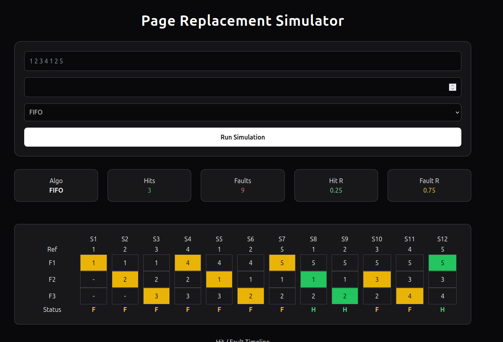
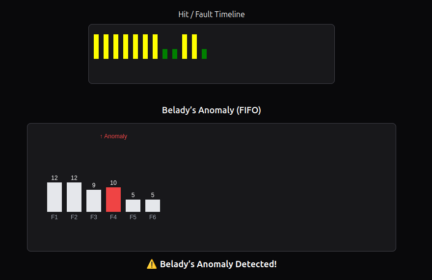

# Virtual Memory Management Simulator  
### (Page Replacement Algorithms Visualization)

---

## 📖 About the project
This project is a **Virtual Memory Management Simulator** that demonstrates how different **Page Replacement Algorithms** work in an operating system.

It provides a **step-by-step visualization** of:
- Page Hits ✅  
- Page Faults ❌  
- Frame allocation  
- Algorithm performance comparison  

The goal is to help understand **Demand Paging** and how OS efficiently manages memory.

---

## 🚀 Features
- 📊 Visual simulation of page replacement  
- 🎯 Supports multiple algorithms:
  - FIFO (First In First Out)
  - LRU (Least Recently Used)
  - Optimal Page Replacement  
- 🟢 Page Hit indication  
- 🟡 Page Fault highlighting  
- 📉 Graphical comparison of algorithms  
- 🧾 Clean tabular output for each step  

---

## 🧠 Algorithms Explained

### 1. FIFO (First In First Out)
- Removes the **oldest page** in memory  
- Simple but may not be efficient  

### 2. LRU (Least Recently Used)
- Removes the page that was **least recently used**  
- Better performance than FIFO in most cases  

### 3. Optimal Algorithm
- Replaces the page that will **not be used for the longest time in future**  
- Gives the **best possible result** (used as benchmark)  

---

## 🖥️ Screenshots

### 🔹 Simulation Output

### 🔹 Belady's anamaly

---

## 🛠️ Tech Stack
- **Frontend:** HTML, CSS, JavaScript, EJS  
- **Backend:** Node.js, Express 
- **Language:** Java, JavaScript  

---
